# Cloudflare Worker Proxy

如果你的网络环境无法正常访问Cloudflare Worker或需要使用不同地域的数据中心,则需要使用上层代理,以下为上层代理样例

```
Dockerfile中的

CMD /usr/local/bin/mitmdump -s /main.py

替换为

CMD /usr/local/bin/mitmdump -s /main.py --mode upstream:http://192.168.89.1:7890
```

>不建议长时间大流量使用

## 免责声明

此工具可能带有攻击性,仅供安全研究与教学之用,用户将其作其他用途,由用户承担全部法律及连带责任

## 实现原理

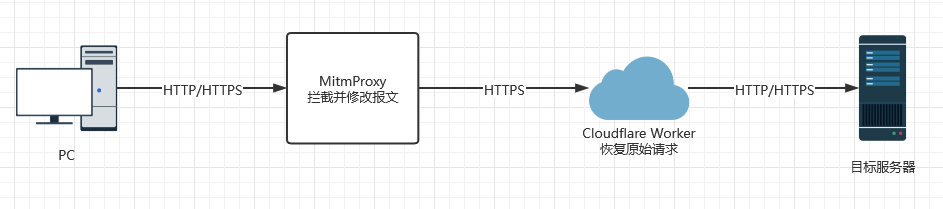

利用MitmProxy提取HTTP/HTTPS请求中的数据,并重新组装成json格式的数据发送到Cloudflare Worker

```python
flow.request = flow.request.make(
    method="POST",
    url="https://{}.{}".format(worker, subdomain),
    content=json.dumps({"method": method, "url": flow.request.url, "headers": headers_base64}),
    headers={"Host": "{}.{}".format(worker, subdomain), "Content-Type": "application/json"},
)
```

Cloudflare Worker解析接收到的数据并由Cloudfare数据中心向目标服务器发送报文

```js
const req = await request.json();
const url = req["url"];
const method = req["method"];
const headers = JSON.parse(atob(req["headers"]));//example: base64encode('{"Content-Type":"application/x-www-form-urlencoded"}')
if (method === 'GET') {
    const init = {
        method: 'GET',
        headers: headers
    };
    const response = await fetch(url, init);
}
return response;
```

## 使用限制

[https://developers.cloudflare.com/workers/platform/limits/](https://developers.cloudflare.com/workers/platform/limits/)

1. Cloudflare Worker限制每天10万次调用

2. 在处理请求时,每个Worker最多可以同时打开六个连接

3. 一个Worker的最大环境变量数是64,每个环境变量的大小限制为5KB

4. 免费帐户的Worker数量限制为30个

5. Direct IP access not allowed(字面意思)

## 使用方法

新建一个Cloudflare Worker,将[cloudflare.js](src/cloudflare.js)中的内容复制到其中即可

向[config.json](src/config.json)中填入`subdomain`和`workerid`

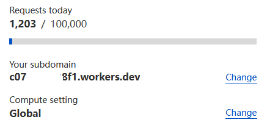

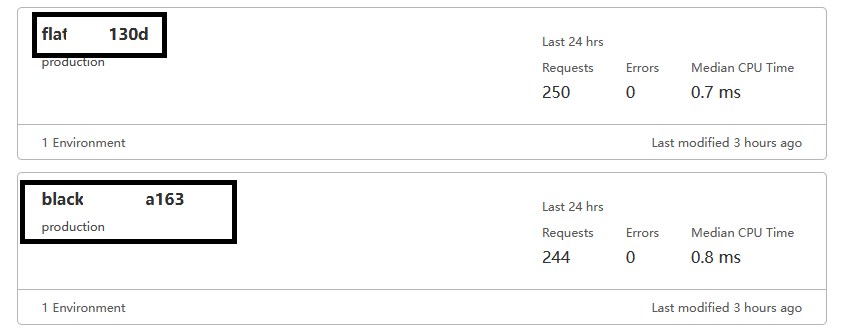

---

填好[config.json](src/config.json)后

```
docker compose build
docker compose up -d
```

运行完成后将浏览器代理设置为docker映射出来的端口,如`http://127.0.0.1:8080`

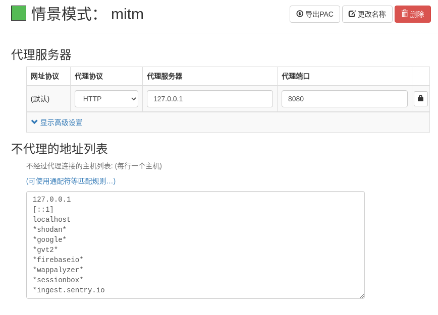

浏览器打开[http://mitm.it/](http://mitm.it/)根据实际情况选择证书安装

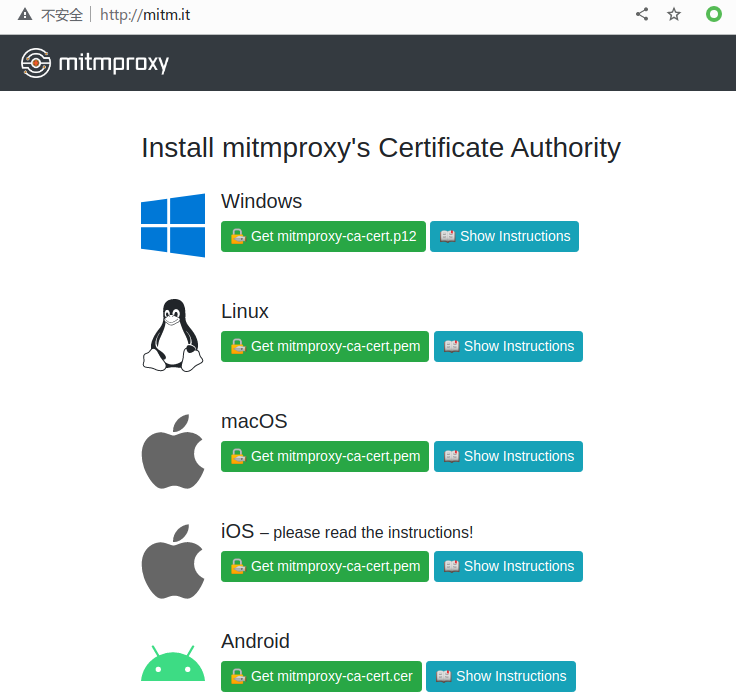

安装完成后重启浏览器即可

## 使用演示

### curl和浏览器访问

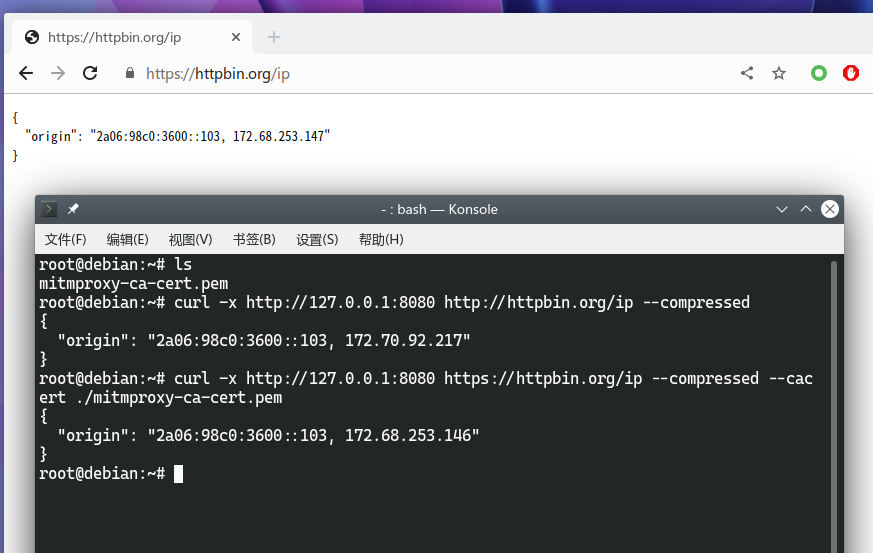

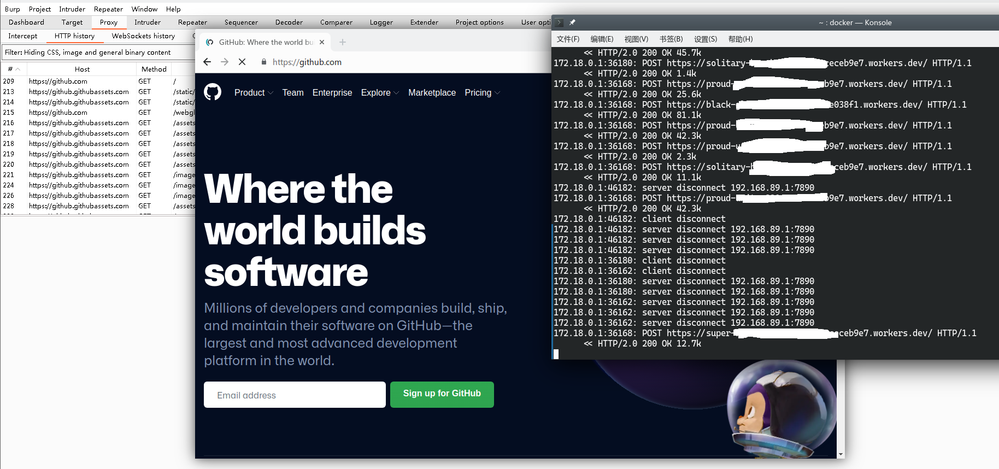

### sqlmap

使用[buuctf[第一章 web入门]SQL注入-1](https://buuoj.cn/challenges#[%E7%AC%AC%E4%B8%80%E7%AB%A0%20web%E5%85%A5%E9%97%A8]SQL%E6%B3%A8%E5%85%A5-1)进行演示

```
sqlmap -u "http://a44b1feb-d7d1-49f1-b871-9074dacfab03.node4.buuoj.cn:81/index.php?id=1" -p "id" --proxy=http://127.0.0.1:8080

sqlmap -u "http://a44b1feb-d7d1-49f1-b871-9074dacfab03.node4.buuoj.cn:81/index.php?id=1" -p "id" --proxy=http://127.0.0.1:8080 --dbs
```

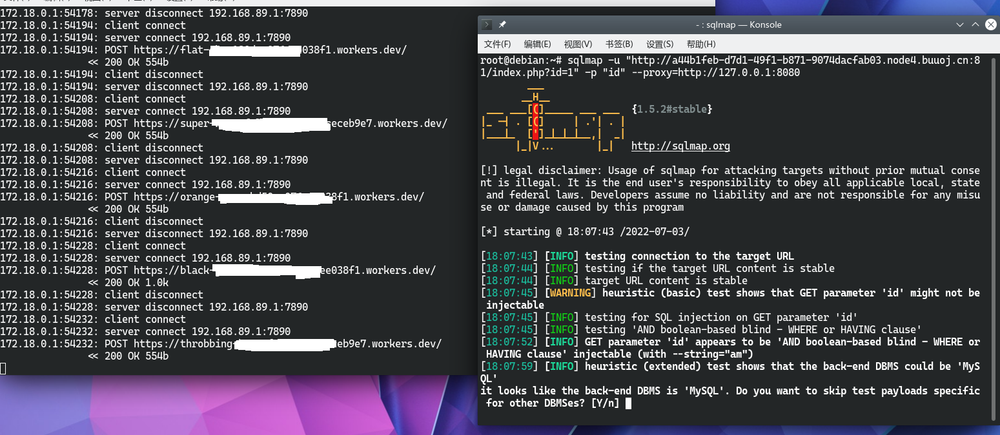

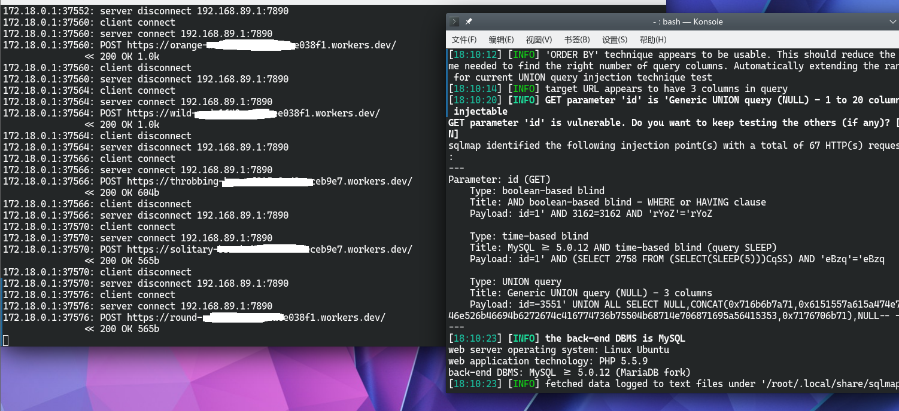

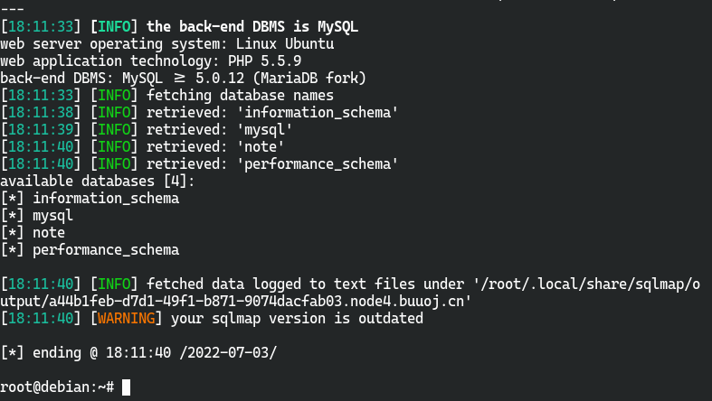

### webshell

使用[buuctf[GXYCTF2019]BabyUpload1](http://5a684d29-4820-46fd-992c-36df32ca007a.node4.buuoj.cn:81/)进行演示

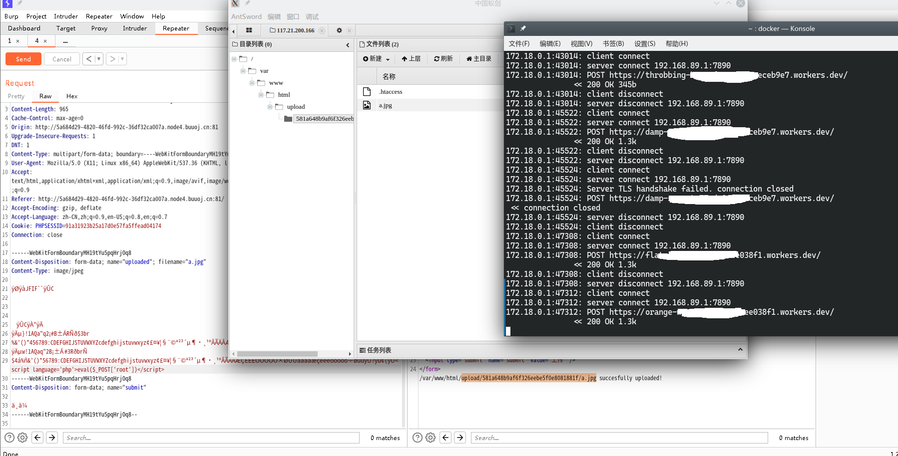

## 注意事项

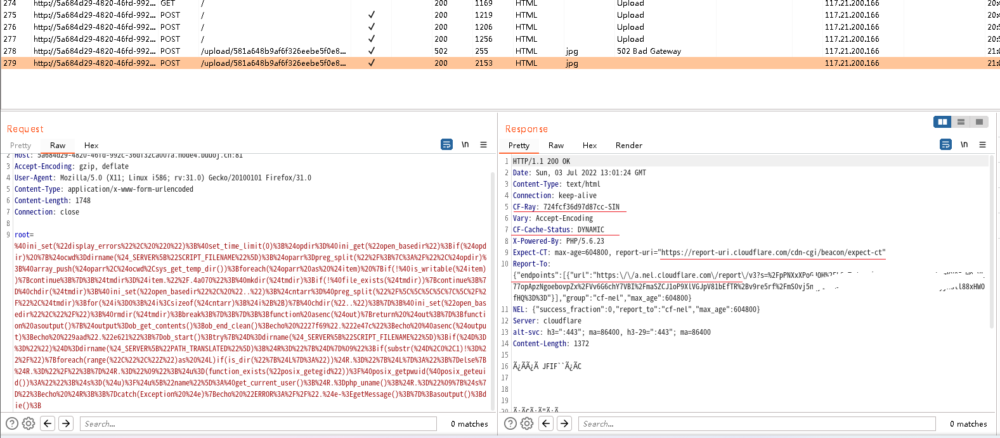

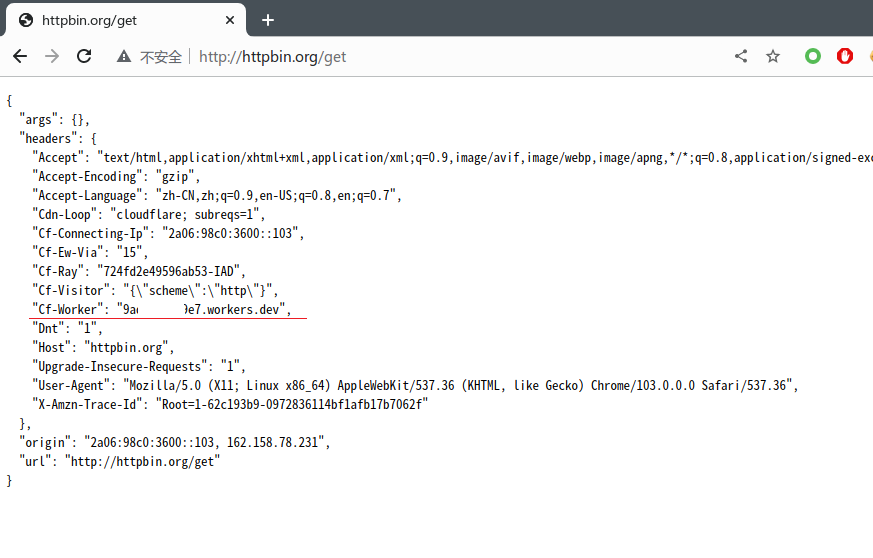

使用时注意指纹泄露

## IP数量

```python
import threading
import requests

ip_set = set()


def getip():
    r = requests.get(url="http://ipinfo.io/ip", proxies={"http": "http://127.0.0.1:8080"})
    ip_set.add(r.text)


if __name__ == '__main__':
    thread_list = []
    for i in range(500):
        t = threading.Thread(target=getip)
        thread_list.append(t)

    for t in thread_list:
        t.start()

    for t in thread_list:
        t.join()

    print(ip_set)
    print(len(ip_set))
```


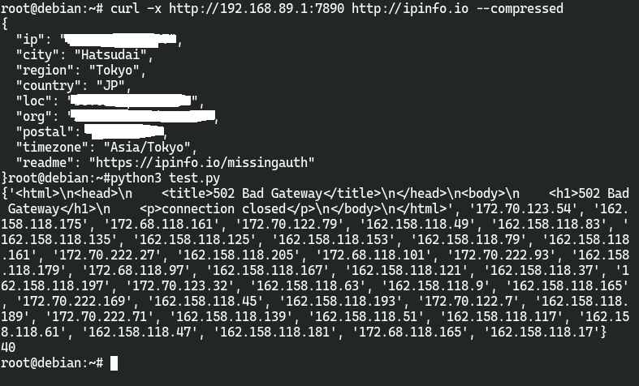

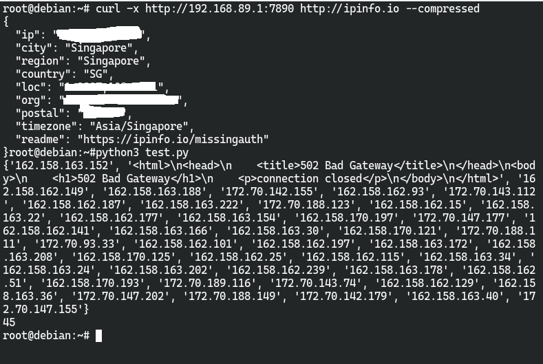

## 威胁情报数据

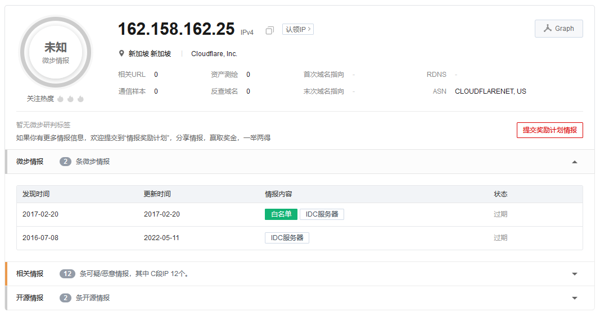

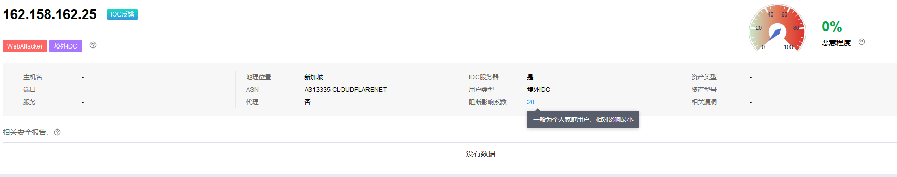

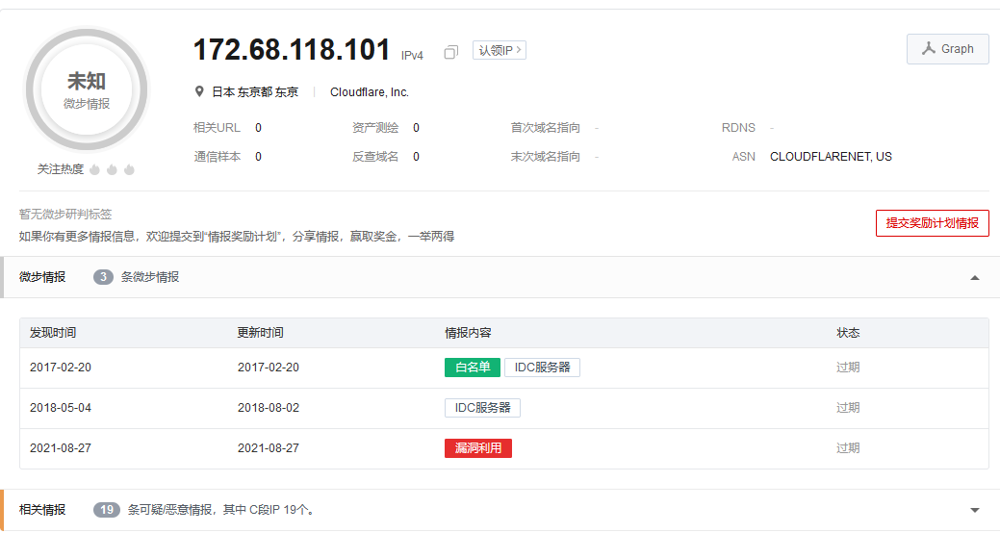

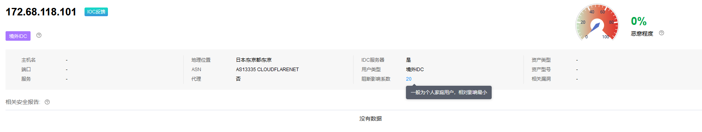

## 防御方法

检查请求头中有没有Cloudflare的特征信息,如`Cf-Ray`和`Cf-Worker`等,或者直接封禁目前已知属于Cloudflare Worker的IP段

```
172.68.0.0/16
172.70.0.0/16
162.158.0.0/16
```

## 参考项目

[浅谈云函数的利用面](https://xz.aliyun.com/t/9502)

[shimmeris/SCFProxy](https://github.com/shimmeris/SCFProxy)